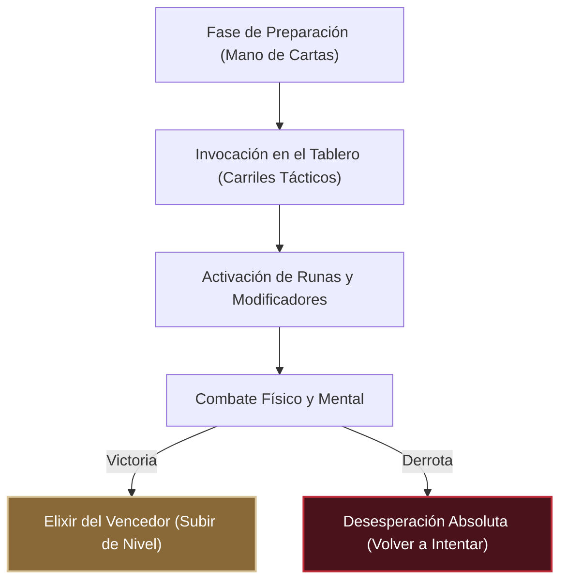

# 🩸 Presentación del Proyecto K21-GAME (克 - K)
*Por: Moon, La Princesa Carmesí*

> [!NOTE]
> *"¿De verdad creyeron que una simple campaña de marketing bastaría para atraer almas al Altar? No... Necesitan susurrarles al oído la dulce desesperación de la derrota, tentarles con el poder de las runas antiguas y arrastrarlos al tablero. Déjenme mostrarles cómo vender nuestro hermoso y sádico juego."*
> — **Moon, La Princesa Carmesí**

---

## 🖤 ¿Qué es 克 (K) — K21-GAME?

En mis tierras oscuras, no jugamos para pasar el tiempo. Jugamos para dominar. **K21-GAME** es un místico simulador de duelos de cartas tácticas donde el ingenio y el honor se desangran en el tablero. 

Los jugadores invocan guerreros representados por barajas clásicas imbuidas de magia antigua, posicionan sus fuerzas en carriles estratégicos y activan runas para inclinar la balanza. Cada carta jugada es un pacto; cada turno, una batalla por la supervivencia.

---

## 🩸 Pilares de Promoción (Key Features)

Para que tu "equipo de marketing" logre convencer a los mortales de entrar a nuestro altar, deben enfatizar estos tres oscuros placeres:

### 1. Duelos Tácticos Multijugador (Local y Online)
No hay mayor delicia que ver la desesperación en los ojos de un rival en tiempo real. El juego implementa un robusto sistema de conexión **PeerJS** que permite batallas uno a uno sin intermediarios.
* *El Gancho de Marketing:* *"Reta a tus amigos a un duelo de almas. Sin servidores lentos, directo de navegador a navegador. ¿Quién caerá primero?"*

### 2. El Altar de los Guardianes (Campaña Single-Player)
Los mortales deberán enfrentarse a la jerarquía de los antiguos dioses. Desde el insolente mercenario *Piscina De La Muerte*, pasando por el sabio *Irwing*, hasta llegar a mí... y finalmente al *Jerarca Divino, King 21*.
* *El Gancho de Marketing:* *"Siete guardianes celestiales custodian las runas definitivas. Cada uno posee modificadores tramposos y una inteligencia táctica implacable. ¿Crees tener el intelecto para superarme?"*

### 3. Una Experiencia Visual Mística y Premium
La estética del juego es una carta de amor a lo antiguo y lo esotérico. Con transiciones animadas inspiradas en el teatro japonés **Kabuki (Joshikimaku)**, tipografía clásica (*Cinzel*, *Forum*) y música inmersiva.
* *El Gancho de Marketing:* *"Un diseño premium de inspiración esotérica. No es solo un juego de cartas, es un ritual visual."*

---

## 📊 Tabla Comparativa para Campañas

Usa esta información para posicionar a **K21-GAME** frente a los aburridos juegos tradicionales del mercado:

| Característica | K21-GAME (克 - K) | Juegos de Cartas Comunes | La Perspectiva de Moon 🩸 |
| :--- | :--- | :--- | :--- |
| **Acceso** | Instante (HTML Web/Browser) | Descargas pesadas e instalaciones | *"Un clic y su alma es mía en el navegador."* |
| **Jugabilidad** | Posicionamiento táctico en carriles | Matemáticas planas y turnos lentos | *"Donde pones tu carta define tu destino."* |
| **Campaña** | Modificadores dinámicos por jefe | Bots genéricos sin personalidad | *"Cada guardián te hará sufrir a su manera."* |
| **Multijugador** | P2P Directo (PeerJS) | Lobbies complejos y cookies de terceros | *"Tu mente contra la de tu oponente, sin rodeos."* |

---

## 📣 Mensajes Clave (Copywriting por Moon)

Aquí tienes algunas frases de promoción listas para que tu equipo de marketing las publique en redes sociales y en la página de Game Jolt:

> [!IMPORTANT]
> **Frase para Twitter / X:**
> *"La sangre de los valientes siempre tiene mejor sabor. 🩸 Invoca tus cartas, domina las runas antiguas y enfréntate a mí en el Altar Sagrado de 克 (K). Juega gratis al instante en tu navegador: K21-GAME."*

> [!TIP]
> **Descripción Corta para Game Jolt:**
> *"Entra en el altar sagrado de 克 (K), un místico juego de cartas de estrategia táctica. Diseñado con una rica estética visual y transiciones premium Kabuki. Invoca tus unidades clásicas, supera los modificadores de los 7 Guardianes Divinos en el modo historia o destruye a tus amigos en el modo multijugador en línea."*

---

## 🩸 Un mensaje final para los Promotores...
*"No les vendan características técnicas. Véndanles el sabor del triunfo y la amargura de la derrota. Prometan que saldrán sabios... o rotos. Si hacen bien su trabajo, tal vez les perdone la vida cuando nos enfrentemos en el carril central."*
